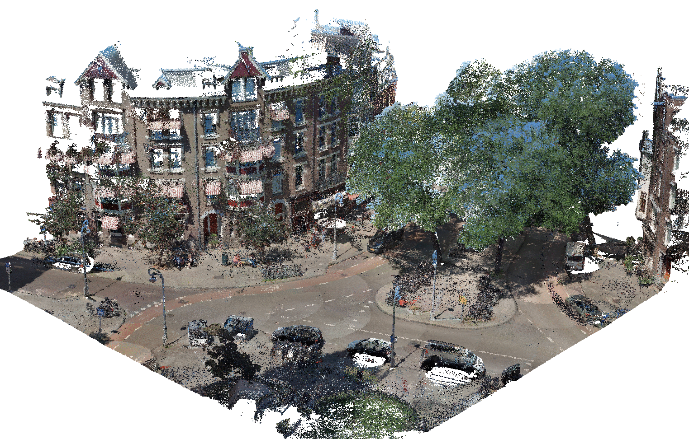

# Urban PointCloud Processing

This repository contains methods for the **automatic classification and labeling of Urban PointClouds** using data fusion. The methods can serve as inspiration, or can be applied as-is under some specific assumptions:

1. Usage in The Netherlands (The "[Rijksdriehoek coordinate system](https://nl.wikipedia.org/wiki/Rijksdriehoeksco%C3%B6rdinaten)");
2. Point clouds in LAS format and tiled following [specific rules](datasets); and
3. Fusion with [AHN](https://www.ahn.nl/) and [BGT](https://www.geobasisregistraties.nl/basisregistraties/grootschalige-topografie) public data sources.

Example [notebooks](notebooks) are provided to demonstrate the tools.

<figure align="center">
  
  <figcaption><b>Example:</b> automatic labeling of ground, road, buildings, cars, trees, street lights, traffic signs, city benches, and rubbish bins.</figcaption>
</figure>

---

## Project Goal

The goal of this project is to automatically locate and classify various assets such as trees, street lights, traffic signs, and other street furniture in street level point clouds. A typical approach would be to build and train a machine learning classier, but this requires a rich labeled dataset to train on. One of the main challenges in working with 3D point cloud data is that, in contrast to 2D computer vision, _no general-purpose training sets are available_. Moreover, the sparsity and non-uniform density of typical point clouds makes transferring results form one task to another difficult.

However, since we are working with urban street level data, we do have access to a large number of public datasets and registries that we can use to start labeling and create an initial training set. This repository contains several **data fusion** methods that combine public datasets such as elevation data, building footprints, and topographic registries to automatically label point clouds.

We also provide some **post-processing** methods that further fine-tune the labels. For example, we use region growing to extend the facade of buildings to include protruding elements such as balconies and canopies that are not included in the building footprint.

For a quick dive into this repository take a look at our [complete solution notebook](notebooks/0.%20Complete%20solution.ipynb).

---

## Folder Structure

 * [`datasets`](./datasets) _Demo dataset to get started_
   * [`ahn`](./datasets/ahn) _AHN data_
   * [`bgt`](./datasets/bgt) _BGT data_
   * [`pointcloud`](./datasets/pointcloud) _Example urban point cloud_
 * [`media`](./media) _Visuals_
   * [`examples`](./media/examples)
 * [`notebooks`](./notebooks) _Jupyter notebook tutorials_
 * [`scripts`](./scripts) _Python scripts_
 * [`src/upcp`](./src/upcp) _Python source code_
   * [`analysis`](./src/upcp/analysis) _Dataset analysis code_
   * [`fusion`](./src/upcp/fusion) _Data fusion code_
   * [`preprocessing`](./src/upcp/preprocessing) _Pre-processing code_
   * [`region_growing`](./src/upcp/region_growing) _Region growing code_
   * [`scrapers`](./src/upcp/scrapers) _Data scrapers_
   * [`utils`](./src/upcp/utils) _Utility functions_

---

## Installation

This code has been tested with `Python >= 3.8` on `Linux` and `MacOS`, and should likely work under Windows as well.

1.  To use this code in development mode simply clone the repository and install the dependencies.

    ```bash
    # Clone the repository
    git clone https://github.com/Amsterdam-AI-Team/Urban_PointCloud_Processing.git

    # Install dependencies
    cd Urban_PointCloud_Processing
    python -m pip install -r requirements.txt
    ```

    or, with Conda:
    ```bash
    conda env create -f environment.yml
    ```

2.  Alternatively, the code can be installed as a Python package from source:

    ```bash
    # Install the latest release as Wheel
    python -m pip install https://github.com/Amsterdam-AI-Team/Urban_PointCloud_Processing/releases/download/v0.1/upcp-0.1-py3-none-any.whl

    # Alternatively, install the latest version from source
    python -m pip install git+https://github.com/Amsterdam-AI-Team/Urban_PointCloud_Processing.git#egg=upcp

    # Or, after making changes in the code
    cd Urban_PointCloud_Processing
    python -m pip install .
    ```

    If you use the latter and want your code changes to take effect without re-installing the package, use the `--editable` flag for pip.

**Additionally**, install `cccorelib` and `pycc` by following the [instructions on their GitHub page](https://github.com/tmontaigu/CloudCompare-PythonPlugin/blob/master/docs/building.rst#building-as-independent-wheels). Please note, these two packages are not available on the Python Package Index (PyPi).

---

## Usage

We provide tutorial [notebooks](notebooks) that demonstrate how the tools can be used.

For visualisation of the resulting labelled point clouds we suggest [CloudCompare](https://www.danielgm.net/cc/). Simply open the labelled .laz in CloudCompare, select the cloud, and set `Colors` to the custom `Scalar Field` named `label`. For best results, use our [custom "AMS" color scale](https://github.com/Amsterdam-AI-Team/Urban_PointCloud_Processing/raw/main/media/cc_color_scale.xml), and set "steps" to 101.

---

## Citing our work

If you use (parts of) this repositiory in your work, please cite [our paper](https://arxiv.org/abs/2108.13757):

```bibtex
@article{bloembergen2021automatic,
  title={Automatic labelling of urban point clouds using data fusion},
  author={Bloembergen, Daan and Eijgenstein, Chris},
  journal={arXiv preprint arXiv:2108.13757},
  year={2021}
}
```

---

## Acknowledgements

This repository was created by [Amsterdam Intelligence](https://amsterdamintelligence.com/) for the City of Amsterdam.

We owe special thanks to [Dr. Sander Oude-Elberink](https://research.utwente.nl/en/persons/sander-oude-elberink) for ideas and brainstorming regarding data fusion with AHN and BGT data.
