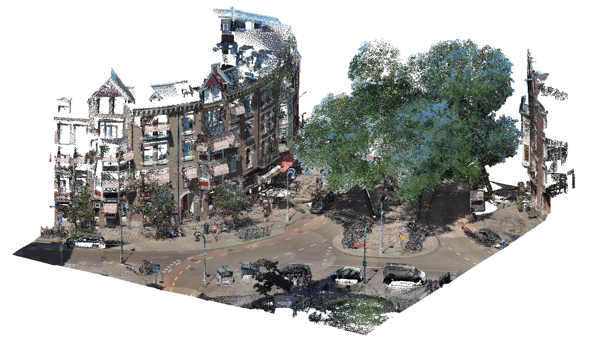

# Urban PointCloud Processing

This repository contains methods for the **automatic classification and labeling of Urban PointClouds** using data fusion. The methods can serve as inspiration, or can be applied as-is under some specific assumptions:

1. Usage in The Netherlands (The "[Rijksdriehoek coordinate system](https://nl.wikipedia.org/wiki/Rijksdriehoeksco%C3%B6rdinaten)");
2. Point clouds in LAS format and tiled following [specific rules](datasets); and
3. Fusion with [AHN](https://www.ahn.nl/) and [BGT](https://www.geobasisregistraties.nl/basisregistraties/grootschalige-topografie) public data sources.

Example [notebooks](notebooks) are provided to demonstrate the tools.

<figure>
  
  <figcaption class="figure-caption text-center"><b>Example:</b> automatic labeling of ground and buildings.</figcaption>
</figure>

---

## Project Folder Structure

 * [`datasets`](./datasets) _Demo dataset to get started_
   * [`ahn`](./datasets/ahn) _AHN data_
   * [`pointcloud`](./datasets/pointcloud) _Example urban point cloud_
 * [`media`](./media) _Visuals_
   * [`examples`](./media/examples)
 * [`notebooks`](./notebooks) _Jupyter notebook tutorials_
 * [`scripts`](./scripts) _Python scripts_
 * [`src`](./src) _Python source code_
   * [`fusion`](./src/fusion) _Data fusion code_
   * [`preprocessing`](./src/preprocessing) _Pre-processing code_
   * [`utils`](./src/utils) _Utility functions_


---

## Installation

1. Clone this repository:
    ```bash
    git clone https://github.com/Amsterdam-AI-Team/Urban_PointCloud_Processing.git
    ```

2. Install all dependencies:
    ```bash
    pip install -r requirements.txt
    ```

3. Check out the [notebooks](notebooks) for a demonstration.

---

## Usage

We provide tutorial [notebooks](notebooks) that demonstrate how the tools can be used.

For visualisation of the resulting labelled point clouds we suggest [CloudCompare](https://www.danielgm.net/cc/). Simply open the labelled .laz in CloudCompare, select the cloud, and set `Colors` to the custom `Scalar Field` named `label`.

---

## Acknowledgements

This repository was created by [Amsterdam Intelligence](https://amsterdamintelligence.com/) for the City of Amsterdam.

We owe special thanks to [Dr. Sander Oude-Elberink](https://research.utwente.nl/en/persons/sander-oude-elberink) for ideas and brainstorming regarding data fusion with AHN and BGT data.
